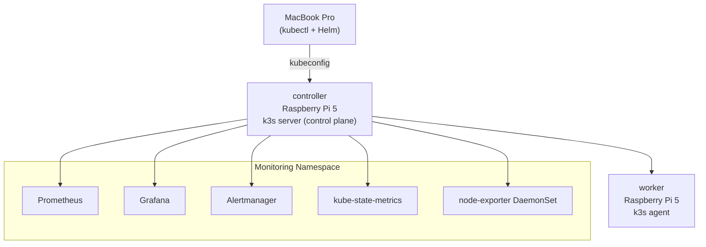

# Kubernetes on Raspberry Pi 5 with k3s and Observability

This repository documents how to build a small, yet realistic Kubernetes lab using **two Raspberry Pi 5 boards**, **k3s**, and a **Prometheus + Grafana** observability stack. It is designed as a **step‑by‑step guide for Junior DevOps engineers** who want to understand the full path from bare metal to a monitored cluster.

---

## High‑Level Architecture

We use:

- **1× Raspberry Pi 5** as the **k3s server** (control plane)
- **1× Raspberry Pi 5** as the **k3s agent** (worker node)
- **1× MacBook (or any laptop)** as the **kubectl + Helm client**
- **kube‑prometheus‑stack** for Prometheus, Alertmanager, Grafana and exporters



---

## Goals of This Guide

By following this README you will learn how to:

1. Prepare **Raspberry Pi 5** boards with **Ubuntu Server 24.04 LTS** for Kubernetes.
2. Install **k3s** with one server node (`controller`) and one agent (`worker`).
3. Configure **kubeconfig** on your **MacBook** so you can run `kubectl` and `helm` locally.
4. Deploy an **observability stack** using `kube-prometheus-stack` with a Pi‑friendly `values.yaml`.
5. Understand and debug common issues (cgroups, SSH problems, read‑only boot partitions, etc.).

The focus is on **clarity** and **learning**, not on building a production‑grade, HA cluster.

---

## 1. Hardware and Software Prerequisites

### 1.1 Hardware

- 2× **Raspberry Pi 5** (4 GB or more recommended)
- 2× **USB‑C power supplies** for Raspberry Pi 5 (ideally official, or at least 5V / 5A)
- 2× **microSD cards** (≥ 32 GB, preferably fast U3 / A2)
- Optional but recommended: heatsinks or cooling cases
- Ethernet connectivity (both Pis connected to the same LAN)

### 1.2 Software

- **Ubuntu Server 24.04 LTS (arm64) for Raspberry Pi** on both boards
- A **MacBook** (or Linux laptop) with:
  - `ssh`
  - `kubectl`
  - `helm`
  - Homebrew (optional but convenient on macOS)

---

## 2. Base OS Setup on the Raspberry Pis

Repeat this section for **both** Pis, but use different hostnames and IP addresses.

### 2.1 Flash Ubuntu 24.04 to SD cards

Use the official **Raspberry Pi Imager** to flash **Ubuntu Server 24.04 LTS (64‑bit)** for Raspberry Pi 5 to each SD card.

In the advanced settings of the Imager:

- Set hostnames, for example:
  - `controller` for the control‑plane node
  - `worker` for the worker node
- Enable **SSH** (password or SSH key)
- Configure **Ethernet or Wi‑Fi** as needed (for Kubernetes, wired Ethernet is strongly recommended).

Insert the SD card into each Pi and boot them.

### 2.2 Log into each Pi

From your Mac:

```bash
ssh controller@controller      # or ssh controller@<controller-ip>
ssh worker@worker              # or ssh worker@<worker-ip>
```

Change passwords if prompted.

### 2.3 Update system packages

On **each** Pi:

```bash
sudo apt update && sudo apt full-upgrade -y
sudo reboot
```

Log back in via SSH after the reboot.

### 2.4 Disable swap

Kubernetes (and k3s) expects swap to be disabled.

On **each** Pi:

```bash
sudo swapoff -a
sudo sed -i '/ swap / s/^/#/' /etc/fstab
```

### 2.5 Check cgroup support

On **each** Pi:

```bash
cat /proc/cgroups | egrep 'memory|cpuset'
```

You should see entries for `memory` and `cpuset` with the final `enabled` column set to `1`. For example:

```text
cpuset  0       87      1
memory  0       87      1
```

On Ubuntu 24.04 for Raspberry Pi 5, this typically works out of the box.

If you ever need to manually enable cgroups, you can extend `/boot/firmware/cmdline.txt` with:

```text
cgroup_enable=cpuset cgroup_enable=memory cgroup_memory=1
```

> **Note:** On some newer non‑LTS images we tried earlier (Ubuntu 25.10), memory cgroups remained unavailable even after setting these flags, which caused k3s to fail to start. That is one reason this guide sticks to **Ubuntu 24.04 LTS**.

---

## 3. Configure Static or Stable IPs

Kubernetes nodes should have **stable IP addresses**.

You can either:

- Use **DHCP reservations** in your router (recommended), or
- Configure static IPs with Netplan inside Ubuntu.

In this guide we assume:

- Controller: `192.168.178.106`
- Worker: `192.168.178.97`

Check with:

```bash
ip a
```

on each node.

---

## 4. Install k3s on the Controller (Server)

### 4.1 Install k3s server

On the **controller** node:

```bash
export MASTER_IP=192.168.178.106
curl -sfL https://get.k3s.io | \
  INSTALL_K3S_EXEC="server \
    --node-ip=${MASTER_IP} \
    --advertise-address=${MASTER_IP} \
    --write-kubeconfig-mode=644" \
  sh -
```

This will:

- Install k3s to `/usr/local/bin/k3s`
- Install and start the `k3s` systemd service
- Create `/etc/rancher/k3s/k3s.yaml` (the kubeconfig file on the controller)

### 4.2 Verify the controller node

On the controller:

```bash
sudo systemctl status k3s
sudo kubectl get nodes
```

You should see the `controller` node in `Ready` state.

---

## 5. Install k3s on the Worker (Agent)

### 5.1 Get the join token from the controller

On the **controller**:

```bash
sudo cat /var/lib/rancher/k3s/server/node-token
```

Copy the full token string (keep it secret; it authorizes nodes to join your cluster).

### 5.2 Install k3s agent on the worker

On the **worker** node:

```bash
export MASTER_IP=192.168.178.106
export WORKER_IP=192.168.178.97
export K3S_TOKEN="<paste-node-token-from-controller-here>"

curl -sfL https://get.k3s.io | \
  K3S_URL="https://${MASTER_IP}:6443" \
  K3S_TOKEN="${K3S_TOKEN}" \
  INSTALL_K3S_EXEC="agent --node-ip=${WORKER_IP}" \
  sh -
```

Check the agent service:

```bash
sudo systemctl status k3s-agent
```

### 5.3 Verify both nodes from the controller

Back on the **controller**:

```bash
sudo kubectl get nodes -o wide
```

Expected output:

```text
NAME         STATUS   ROLES                  AGE   VERSION            INTERNAL-IP
controller   Ready    control-plane,master   ...   v1.33.x+k3s1       192.168.178.106
worker       Ready    <none>                 ...   v1.33.x+k3s1       192.168.178.97
```

You can optionally label the worker as a "worker" node:

```bash
sudo kubectl label node worker node-role.kubernetes.io/worker=worker
```

---

## 6. Configure kubeconfig on Your Mac

### 6.1 Export kubeconfig from the controller

On the **controller**:

```bash
sudo cat /etc/rancher/k3s/k3s.yaml
```

Copy the entire file content.

### 6.2 Create a kubeconfig on your Mac

On your **Mac**:

```bash
mkdir -p ~/.kube
nano ~/.kube/config-pi-cluster
```

Paste the content from `k3s.yaml`.

Then in that file, change the `server` line from:

```yaml
server: https://127.0.0.1:6443
```

to:

```yaml
server: https://192.168.178.106:6443
```

Optionally rename the current context to `pi-cluster`:

```yaml
contexts:
- context:
    cluster: default
    user: default
  name: pi-cluster
current-context: pi-cluster
```

### 6.3 Install kubectl (if needed)

On macOS with Homebrew:

```bash
brew install kubectl
```

### 6.4 Use the kubeconfig

On your Mac:

```bash
export KUBECONFIG=$HOME/.kube/config-pi-cluster
kubectl config get-contexts
kubectl get nodes
```

You should see both `controller` and `worker` from your laptop.

---

## 7. Install kube-prometheus-stack (Prometheus + Grafana)

We now install a small observability stack using the `kube-prometheus-stack` Helm chart, with a custom values file optimized for Raspberry Pi.

### 7.1 Install Helm (if needed)

On your Mac:

```bash
brew install helm
```

### 7.2 Create monitoring namespace and add Helm repo

```bash
kubectl create namespace monitoring

helm repo add prometheus-community https://prometheus-community.github.io/helm-charts
helm repo update
```

### 7.3 Create the values file

Create a working directory on your Mac:

```bash
mkdir -p ~/k8s/pi-monitoring
cd ~/k8s/pi-monitoring
nano values-kube-prometheus-pi.yaml
```

Paste the following content:

```yaml
# values-kube-prometheus-pi.yaml
#
# This values file is tuned for a small 2-node k3s cluster on Raspberry Pi 5.
# It reduces resource requests/limits and keeps the setup simple.

# Grafana configuration

grafana:
  adminUser: admin
  adminPassword: admin
  service:
    type: ClusterIP
  resources:
    requests:
      cpu: 100m
      memory: 128Mi
    limits:
      cpu: 300m
      memory: 256Mi

# Prometheus configuration

prometheus:
  prometheusSpec:
    resources:
      requests:
        cpu: 100m
        memory: 256Mi
      limits:
        cpu: 500m
        memory: 512Mi
    retention: 24h

# Alertmanager configuration

alertmanager:
  alertmanagerSpec:
    replicas: 1
    resources:
      requests:
        cpu: 50m
        memory: 64Mi
      limits:
        cpu: 200m
        memory: 128Mi

# kube-state-metrics configuration

kube-state-metrics:
  resources:
    requests:
      cpu: 50m
      memory: 64Mi
    limits:
      cpu: 200m
      memory: 128Mi

# node-exporter configuration

nodeExporter:
  resources:
    requests:
      cpu: 20m
      memory: 32Mi
    limits:
      cpu: 100m
      memory: 64Mi
```

### 7.4 Explanation of the values file (for Junior DevOps)

**`grafana`**

- `adminUser` / `adminPassword` – default login for Grafana. In a real environment you must change these or use a secret.
- `service.type: ClusterIP` – Grafana is only exposed inside the cluster. We access it via `kubectl port-forward` from the Mac.
- `resources` – defines CPU and memory reservations:
  - `requests` – what Grafana asks from the scheduler as a minimum
  - `limits` – hard maximums, to prevent Grafana from consuming too many resources on the Pis

**`prometheus.prometheusSpec`**

- `resources` – similar to Grafana, but slightly higher because Prometheus stores and queries time series data.
- `retention: 24h` – keep metrics only for 24 hours. This reduces disk space usage, which is important on SD cards.

**`alertmanager.alertmanagerSpec`**

- `replicas: 1` – a single Alertmanager instance is enough for a home lab.
- `resources` – very small footprint, because our alert configuration is minimal.

**`kube-state-metrics`**

- Exports Kubernetes object state (Deployments, Pods, Nodes, etc.) as metrics for Prometheus.
- Again, we keep CPU/memory low for a small cluster.

**`nodeExporter`**

- Runs as a DaemonSet on each node and exports system-level metrics (CPU, RAM, disk, etc.).
- Resource requests are small to avoid impacting the Pi’s performance.

Overall, this values file shows how to **tune Helm charts for small hardware**:

- Lower CPU/memory requests and limits
- Shorter data retention
- Fewer replicas

### 7.5 Install kube-prometheus-stack

From the directory with your values file:

```bash
helm install monitoring prometheus-community/kube-prometheus-stack \
  --namespace monitoring \
  -f values-kube-prometheus-pi.yaml
```

Check the pods:

```bash
kubectl get pods -n monitoring
```

Wait until all are in `Running` state.

### 7.6 Access Grafana via port-forward

```bash
➜  pi-monitoring git:(main) ✗ k get nodes
NAME         STATUS   ROLES                  AGE   VERSION
controller   Ready    control-plane,master   36m   v1.33.6+k3s1
worker       Ready    worker                 28m   v1.33.6+k3s1


➜  pi-monitoring git:(main) ✗ k create ns monitoring
namespace/monitoring created

➜  pi-monitoring git:(main) ✗ helm repo add prometheus-community https://prometheus-community.github.io/helm-charts
helm repo update
"prometheus-community" already exists with the same configuration, skipping
Hang tight while we grab the latest from your chart repositories...
...Successfully got an update from the "opensearch" chart repository
...Successfully got an update from the "cert-exporter" chart repository
...Successfully got an update from the "sloth" chart repository
...Successfully got an update from the "jaegertracing" chart repository
...Successfully got an update from the "minio" chart repository
...Successfully got an update from the "opentelemetry" chart repository
...Successfully got an update from the "open-telemetry" chart repository
...Successfully got an update from the "apisix" chart repository
...Successfully got an update from the "prometheus-blackbox" chart repository
...Successfully got an update from the "prometheus-json-exporter" chart repository
...Successfully got an update from the "prometheus-community" chart repository
...Successfully got an update from the "grafana" chart repository
...Successfully got an update from the "bitnami" chart repository
Update Complete. ⎈Happy Helming!⎈


➜  pi-monitoring git:(main) ✗ helm install monitoring prometheus-community/kube-prometheus-stack --namespace monitoring -f values-kube-prometheus-pi.yaml 
NAME: monitoring
LAST DEPLOYED: Tue Dec  2 18:17:37 2025
NAMESPACE: monitoring
STATUS: deployed
REVISION: 1
NOTES:
kube-prometheus-stack has been installed. Check its status by running:
  kubectl --namespace monitoring get pods -l "release=monitoring"

Get Grafana 'admin' user password by running:

  kubectl --namespace monitoring get secrets monitoring-grafana -o jsonpath="{.data.admin-password}" | base64 -d ; echo

Access Grafana local instance:

  export POD_NAME=$(kubectl --namespace monitoring get pod -l "app.kubernetes.io/name=grafana,app.kubernetes.io/instance=monitoring" -oname)
  kubectl --namespace monitoring port-forward $POD_NAME 3000

Get your grafana admin user password by running:

  kubectl get secret --namespace monitoring -l app.kubernetes.io/component=admin-secret -o jsonpath="{.items[0].data.admin-password}" | base64 --decode ; echo


Visit https://github.com/prometheus-operator/kube-prometheus for instructions on how to create & configure Alertmanager and Prometheus instances using the Operator.
➜  pi-monitoring git:(main) ✗ k config set-context --current --namespace monitoring 
Context "default" modified.
➜  pi-monitoring git:(main) ✗ k get pods
...
➜  pi-monitoring git:(main) ✗ k get pods
NAME                                                     READY   STATUS    RESTARTS   AGE
alertmanager-monitoring-kube-prometheus-alertmanager-0   2/2     Running   0          2m7s
monitoring-grafana-746c5564fc-r45bl                      2/3     Running   0          2m24s
monitoring-kube-prometheus-operator-7b4f579bf4-78dxz     1/1     Running   0          2m24s
monitoring-kube-state-metrics-7d6fdb9d66-4sg26           1/1     Running   0          2m24s
monitoring-prometheus-node-exporter-cxx2c                1/1     Running   0          2m24s
monitoring-prometheus-node-exporter-h29gw                1/1     Running   0          2m24s
prometheus-monitoring-kube-prometheus-prometheus-0       2/2     Running   0          2m6s
➜  pi-monitoring git:(main) ✗ oc port-forward pods/monitoring-grafana-746c5564fc-r45bl 3000:3000
Forwarding from 127.0.0.1:3000 -> 3000
Forwarding from [::1]:3000 -> 3000
Handling connection for 3000
Handling connection for 3000
```

Now open:

- http://localhost:3000

Login with:

- **User:** `admin`
- **Password:** `admin` (from the values file)

You will find Kubernetes and node dashboards already pre‑installed.

---

## 8. Simple Workload and Metrics Check

To verify that workloads run and metrics are collected, deploy a simple nginx service.

### 8.1 Deploy nginx

```bash
kubectl create deployment hello-nginx --image=nginx
kubectl expose deployment hello-nginx --type=NodePort --port=80
kubectl get svc hello-nginx
```

Note the `NodePort` (e.g. `30080`).

You can now access nginx via:

- `http://192.168.178.106:<NodePort>` (controller)
- or `http://192.168.178.97:<NodePort>` (worker)

After some traffic, you should see metrics in Grafana for:

- Pods and deployments
- Node CPU, memory, and network usage

---

## 9. Challenges and Lessons Learned

During the setup, we hit several real‑world issues that are valuable for Junior DevOps to understand.

### 9.1 SSH and hostname resolution

**Problem:**

- Initially, `ssh control@control` failed with `Could not resolve hostname control`.
- `ssh control@<ip>` sometimes resulted in `Connection refused` if SSH was not enabled or not running.

**What we learned:**

- Make sure SSH is enabled on the Raspberry Pi images (via Raspberry Pi Imager settings).
- Use the Pi’s IP address first (e.g. `ssh user@192.168.x.x`).
- Only rely on hostnames like `controller` or `controller.local` when mDNS/DNS is correctly set up.

### 9.2 Read‑only `/boot/firmware` and cgroup flags on the wrong OS

**Problem:**

- On an earlier attempt with **Ubuntu 25.10** and a newer kernel, `/boot/firmware` was mounted read‑only.
- Even after adding `cgroup_enable=memory cgroup_memory=1 cgroup_enable=cpuset` to `cmdline.txt`,
  `cat /proc/cgroups | grep memory` showed **no memory cgroup**.
- k3s failed to start with errors like:
  
  > Failed to find memory cgroup, you may need to add "cgroup_memory=1 cgroup_enable=memory" to your linux cmdline

**What we learned:**

- Very new, non‑LTS distributions and kernels on Raspberry Pi can have incomplete or problematic cgroup support.
- For Kubernetes/k3s on Raspberry Pi, **Ubuntu 24.04 LTS** is currently a much safer choice than cutting‑edge images.
- Always verify cgroups with:

  ```bash
  cat /proc/cgroups | egrep 'memory|cpuset'
  ```

  before debugging k3s itself.

### 9.3 Choosing k3s instead of full kubeadm

**Decision point:**

- It is possible to run a “full” Kubernetes setup with `kubeadm`, containerd, CNI plugins, etc.,
  but this is more complex and heavier for Raspberry Pi.

**What we learned:**

- **k3s** is:
  - CNCF‑certified Kubernetes
  - optimized for ARM and edge use cases
  - simple to install and operate
- For a 2‑node home lab, k3s provides almost everything you need with much less effort.

### 9.4 Tuning observability for small hardware

**Challenge:**

- Default resources for Prometheus, Grafana, and exporters can be too heavy for small ARM boards.

**What we learned:**

- Always review and adjust `resources.requests` and `resources.limits` in Helm values files.
- Shorter metric retention (`24h` instead of weeks) significantly reduces disk pressure on SD cards.
- It is better to start with conservative resource usage and increase if necessary.

---

## 10. What a Junior DevOps Should Take Away

1. **End‑to‑end thinking:** From hardware power supply to OS, kernel features (cgroups), and Kubernetes configuration – everything matters.
2. **Start with stable bases:** LTS distributions (like Ubuntu 24.04) are usually safer for Kubernetes than the newest releases.
3. **Always verify fundamentals:**
   - Network connectivity
   - SSH access
   - Swap disabled
   - cgroups enabled
4. **Use lightweight Kubernetes for labs:** k3s is ideal for learning on limited hardware.
5. **Observability is part of the platform:** Deploying Prometheus and Grafana early helps you understand how your cluster behaves under load.
6. **Document everything:** Keeping a record (like this README) is key when you want to share your knowledge or reproduce a setup.

---

## 11. Next Steps

Some ideas to extend this lab:

- Add **persistent storage** (e.g. NFS or Longhorn) instead of only local storage.
- Deploy a small **demo application** with real SLOs and alerts.
- Integrate **Loki** for logs and connect it to Grafana.
- Experiment with **GitOps** (e.g. Argo CD or Flux) for managing manifests.

---

## License

This project is licensed under the **MIT License** – see below for details.

You are free to use, modify, and distribute this project for personal or commercial purposes. Attribution is appreciated but not required.

```
MIT License

Copyright (c) 2025 Mistral-valaise

Permission is hereby granted, free of charge, to any person obtaining a copy
of this software and associated documentation files (the "Software"), to deal
in the Software without restriction, including without limitation the rights
to use, copy, modify, merge, publish, distribute, sublicense, and/or sell
copies of the Software, and to permit persons to whom the Software is
furnished to do so, subject to the following conditions:

The above copyright notice and this permission notice shall be included in all
copies or substantial portions of the Software.

THE SOFTWARE IS PROVIDED "AS IS", WITHOUT WARRANTY OF ANY KIND, EXPRESS OR
IMPLIED, INCLUDING BUT NOT LIMITED TO THE WARRANTIES OF MERCHANTABILITY,
FITNESS FOR A PARTICULAR PURPOSE AND NONINFRINGEMENT. IN NO EVENT SHALL THE
AUTHORS OR COPYRIGHT HOLDERS BE LIABLE FOR ANY CLAIM, DAMAGES OR OTHER
LIABILITY, WHETHER IN AN ACTION OF CONTRACT, TORT OR OTHERWISE, ARISING FROM,
OUT OF OR IN CONNECTION WITH THE SOFTWARE OR THE USE OR OTHER DEALINGS IN THE
SOFTWARE.
```
